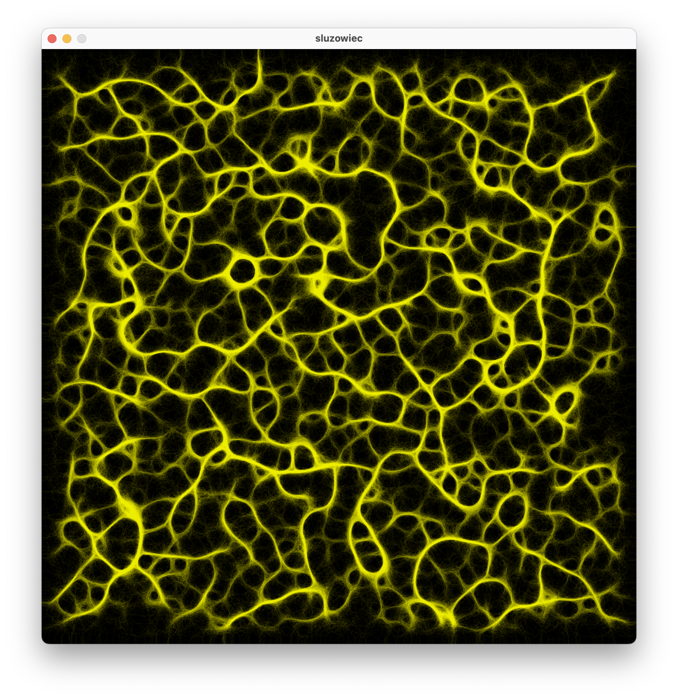
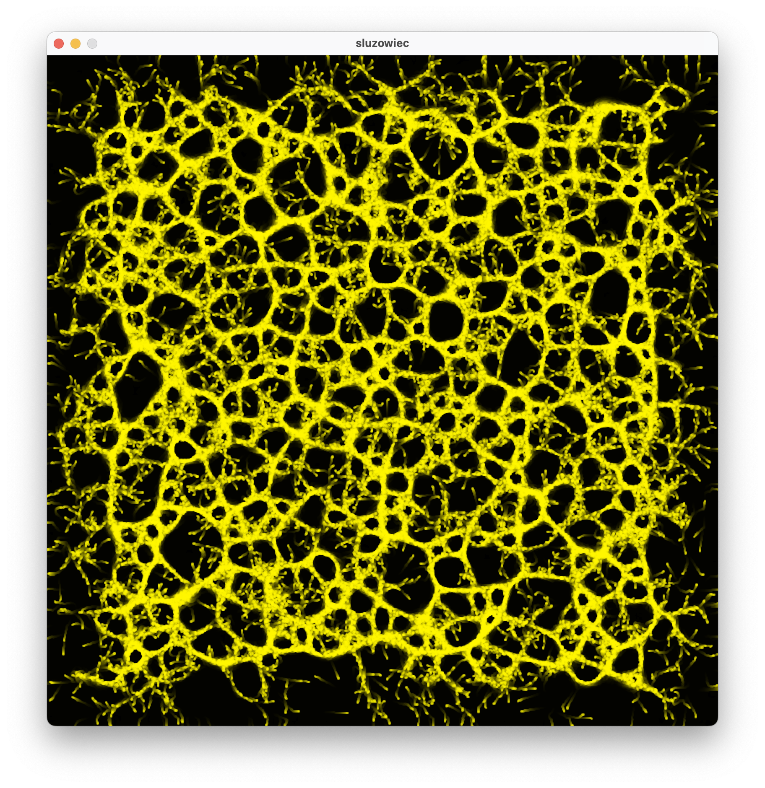
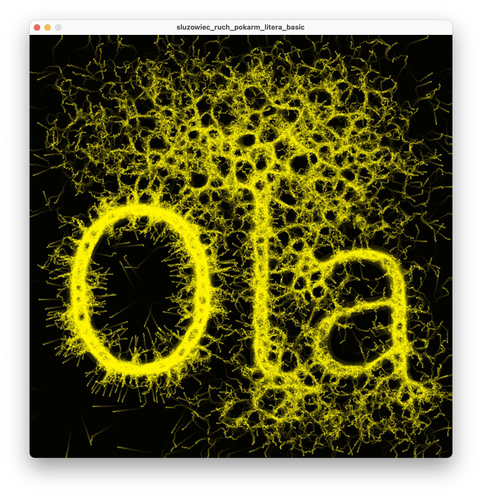
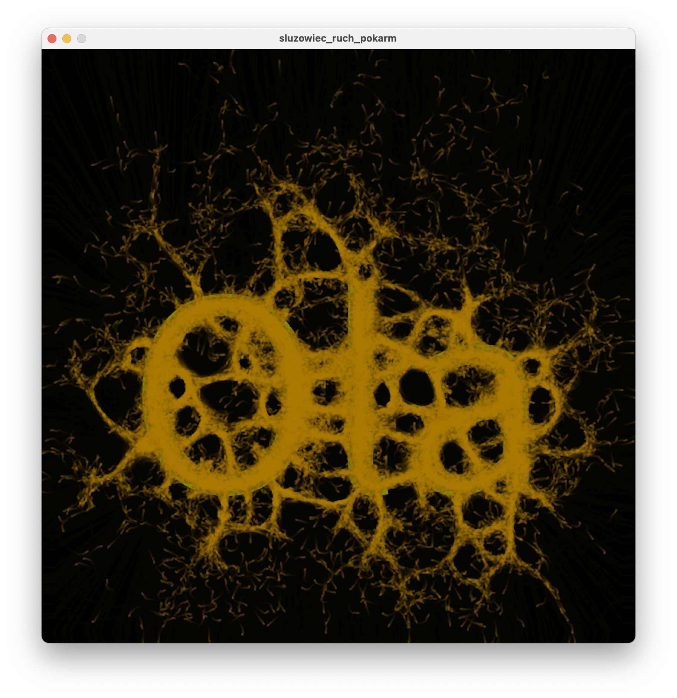
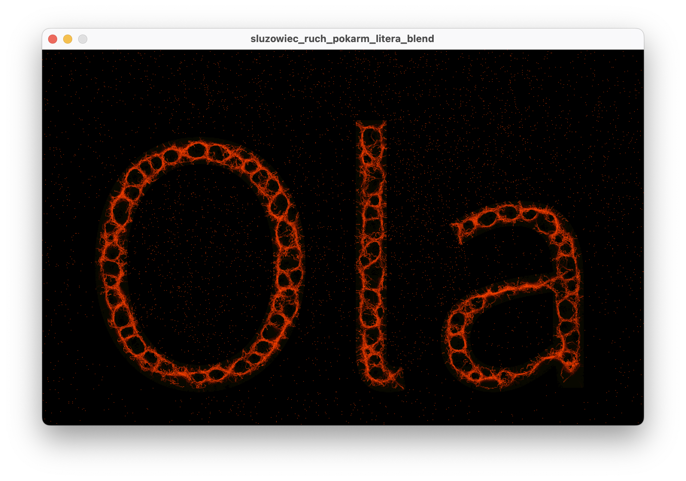

# Inspiracje S03 - Wprowadzenie do systemów złożonych cz.2

Tym razem sztuczne życie, czyli symulacje śluzowca, przy okazji tworzące niezwykłe artefakty wizualne.

## Zagadnienia
- Wyjaśnienie czym jest śluzowiec
- Wprowadzenie do modelu śluzowca (a konkretnie Physarum polycephalum) bazujące na artykule “Characteristics of Pattern Formation and Evolution in Approximations of Physarum Transport Networks”
- Stworzenie symulacji na podstawie artykułu
- Eksperymenty z parametrami symulacji
- Tworzenie nowych wariantów symulacji

## Processing
- Wykorzystanie dobrze znanego typu ‘PVector’ do modelowania położenia i ruchu. 
- ‘PGraphics’ typ graficzny
- ‘createGraphics();’ tworzy grafikę rastrową, do obsługi kodem
- ‘beginDraw(); endDraw();’ pomiędzy tymi poleceniami wykonujemy operacje graficzne  

## Materiały pomocnicze
- [Śluzowiec](https://pl.wikipedia.org/wiki/Śluzowce)
- [Characteristics of pattern formation and evolution in approximations of physarum transport networks](https://uwe-repository.worktribe.com/OutputFile/980585)

## Eksperymenty 

