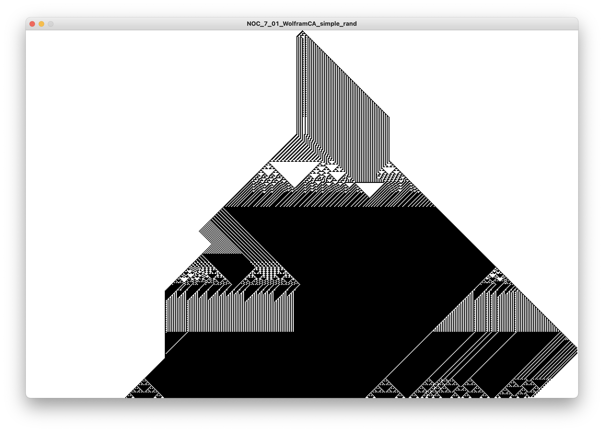
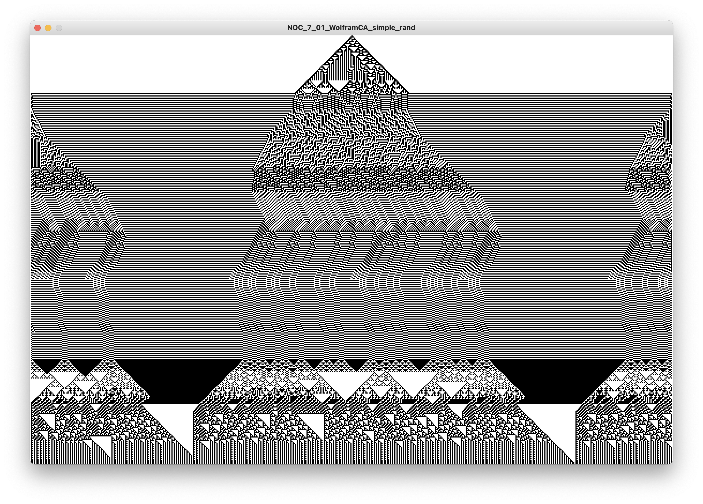
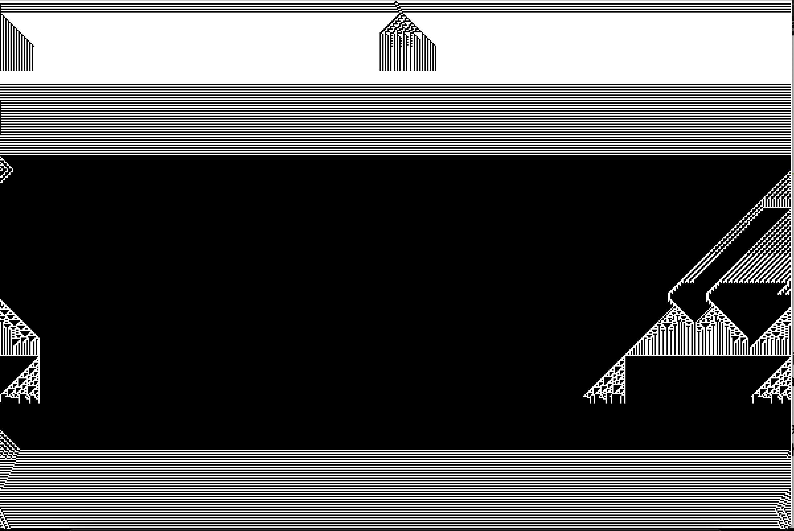

# Inspiracje s04 - Wprowadzenie do systemów złożonych cz.1

Z cyklu inspiracje. Wykład o systemach złożonych i możliwości wykorzystanie symulacji takich systemów w tworzeniu artefaktów wizualnych

## Zagadnienia
- Wyjaśnienie czym jest nauka o systemach złożonych
- Przykład układu złożonego uporządkowanego: automat komórkowy jednowymiarowy
- Przykład układu złożonego chaotycznego: układ Lorenza

## Processing
- Biblioteka PeasyCam do rotacji kamery w 3D za pomocą myszki itp.

## Materiały pomocnicze
- Wideo [What is a Complex System?](https://youtu.be/vp8v2Udd_PM)
- [Definicja systemu złożonego](https://en.wikipedia.org/wiki/Complex_system)
- Wiki [Lorenz System](https://en.wikipedia.org/wiki/Lorenz_system)
- Wiki [Układ Lorenza](https://pl.wikipedia.org/wiki/Układ_Lorenza)
Wolfram [Elementary Cellular Automaton](https://mathworld.wolfram.com/ElementaryCellularAutomaton.html)

## Eksperymenty z automatami

